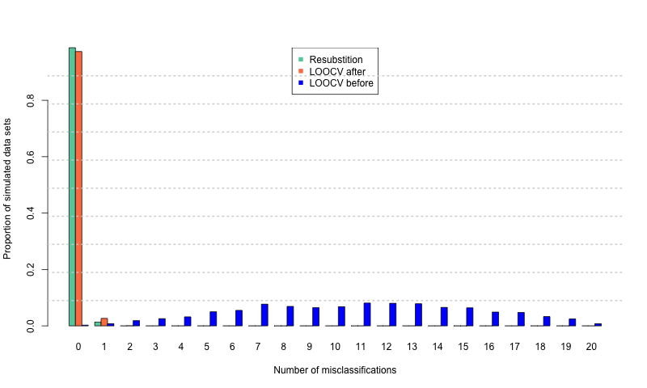
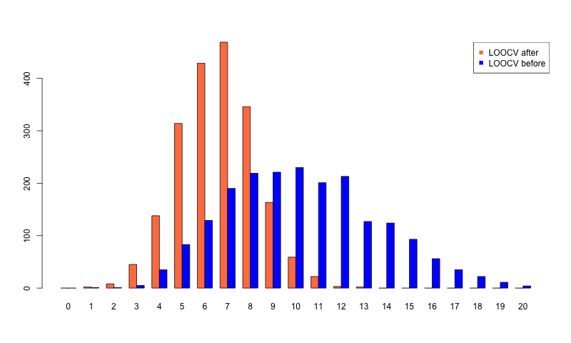

```{r setup, include=FALSE}
knitr::opts_chunk$set(echo = TRUE, eval = FALSE)
```

## One Data Set

Goal: Repeat the result from the 
[paper](https://brb.nci.nih.gov/techreport/JNCICommentary.pdf) published in JNCI 2003.

Settings:

* n=20=10+10
* p=6000
* Prediction method: compound covariate prediction
* Gene selection method: 10 genes based on two-sample t-test

Compare

1. Resubstitution
2. LOOCV removal of the left-out specimen after selection of differentially expressed genes (wrong)
3. LOOCV removal of the left-out specimen before selection of differentially expressed genes (right way to do)

```{r}
ccp.train <- function(x, tt) {
  cc <- apply(x, 2, function(y) sum(tt * y))
  cc
}

ccp.predict <- function(c1, c2, tt, xnew) {
  cnew <- apply(xnew, 2, function(y) sum(tt * y))
  cmean <- (c1+c2)/2.0
  if (c1 <= c2) {
    pred <- ifelse(cnew <= cmean, 1, 2)
  } else {
    pred <- ifelse(cnew > cmean, 1, 2)
  }
  pred
}

n <- 20
p <- 6000
pg <- 10  # select 10 genes
set.seed(1234)
x <- matrix(rnorm(n*p), nr=p)
# assume the first 10 samples are in class 1, the rest samples are in class 2

# Resubstitution
out <- t.testv(x, 10, 10)
indgene <- order(out$pval)[1:pg]
ccp.tr <- ccp.train(x[indgene, ], out$t[indgene])
ccp.pr <- ccp.predict(mean(ccp.tr[1:10]), mean(ccp.tr[11:20]), 
                      out$t[indgene], x[indgene, ])
err <- sum(abs(ccp.pr - c(rep(1, 10), rep(2, 10))))
err 
# 0

# LOOCV after gene selection 
out <- t.testv(x, 10, 10)
indgene <- order(out$pval)[1:pg]
ccp.pr <- rep(NA, n)
for(j in 1:n) {
  ccp.tr <- ccp.train(x[indgene, -j], out$t[indgene])
  if (j <= 10) {
    ccp.pr[j] <- ccp.predict(mean(ccp.tr[1:9]), mean(ccp.tr[10:19]), 
                        out$t[indgene], x[indgene, j, drop = F])
  } else {
    ccp.pr[j] <- ccp.predict(mean(ccp.tr[1:10]), mean(ccp.tr[11:19]), 
                        out$t[indgene], x[indgene, j, drop = F])    
  }
}
err <- sum(abs(ccp.pr - c(rep(1, 10), rep(2, 10))))
err
# 0

# LOOCV before gene selection
ccp.pr <- rep(NA, n)
for(j in 1:n) {
  if (j <= 10) {
    n1 <- 9; n2 <- 10
  } else {
    n1 <- 10; n2 <- 9
  }
  out <- t.testv(x[, -j], n1, n2)
  indgene <- order(out$pval)[1:pg]
  ccp.tr <- ccp.train(x[indgene, -j], out$t[indgene])
  if (j <= 10) {
    ccp.pr[j] <- ccp.predict(mean(ccp.tr[1:9]), mean(ccp.tr[10:19]), 
                        out$t[indgene], x[indgene, j, drop = F])
  } else {
    ccp.pr[j] <- ccp.predict(mean(ccp.tr[1:10]), mean(ccp.tr[11:19]), 
                        out$t[indgene], x[indgene, j, drop = F])    
  }
}
err <- sum(abs(ccp.pr - c(rep(1, 10), rep(2, 10))))
err
# 8
```

## 2000 Simulated Data Sets

We can wrap the above scripts into 3 functions: rsbst(), loocv1() and loocv2(). rsbst() represents resubstitution method, loocv1() denotes LOOCV after gene selection and loocv2() denotes LOOCV before gene selection.

We draw a bar plot with X-axis = number of misclassifications, Y-axis = proportion of simulated data sets.

```{r}
source("util.R")
nsim <- 2000
p <- 6000
pg <- 10  # select 10 genes

set.seed(1234)
out1 <- replicate(nsim, rsbst(p, pg))

set.seed(1234)
out2 <- replicate(nsim, loocv1(p, pg))

set.seed(1234)
out3 <- replicate(nsim, loocv2(p, pg))
save(out1, out2, out3, file = "out.rda")
load("out.rda")

# combine the result together
outall <- rbind(table(factor(out1, levels = as.character(0:20))),
                table(factor(out2, levels = as.character(0:20))),
                table(factor(out3, levels = as.character(0:20))))
outall
#        0  1  2  3  4   5   6   7   8   9  10  11  12  13  14  15 16 17 18 19 20
#[1,] 1973 27  0  0  0   0   0   0   0   0   0   0   0   0   0   0  0  0  0  0  0
#[2,] 1946 53  1  0  0   0   0   0   0   0   0   0   0   0   0   0  0  0  0  0  0
#[3,]    5 15 37 51 64 100 110 154 138 129 136 162 160 157 131 128 98 95 66 49 15

png("outall.png", width=800, height=480)
barplot(outall, beside=TRUE, 
        col=c("aquamarine3", "coral", "blue"), 
        names.arg=as.character(0:20))

legend(10, 1500, c("Resubstition", "LOOCV after", "LOOCV before"),
       col=c("aquamarine3", "coral", "blue"), pch=15)
dev.off()
```



## Observations

Note that under the null hypothesis, the estimated error rates for simulated datasets should center around 0.5 (i.e. 10 misclassifications of 20).

* Resubstitution method is biased for small datasets. About 98% (=1973/2000) of the simulated datasets resulting in zero misclassifications
* LOOCV after gene selection does little to correct the bias, with 97% (=1946/2000) of simulated datasets still resulting in zero misclassifications.

## Low Dimension Case

```{r}
source("util.R")
nsim <- 2000
p <- 5
pg <- 2  # select 2 genes

set.seed(1234)
out4 <- replicate(nsim, loocv1(p, pg))

set.seed(1234)
out5 <- replicate(nsim, loocv2(p, pg))
save(out4, out5, file = "outlowd.rda")
load("outlowd.rda")
outlowd <- rbind(table(factor(out4, levels = as.character(0:20))),
                table(factor(out5, levels = as.character(0:20))))
outlowd
#     0 1 2  3   4   5   6   7   8   9  10  11  12  13  14 15 16 17 18 19 20
#[1,] 0 2 8 45 138 314 429 469 346 163  59  22   3   2   0  0  0  0  0  0  0
#[2,] 0 1 1  5  35  83 129 190 219 221 230 201 213 127 124 93 56 35 22 11  4

png("lowdim.png", width=800, height=480)
barplot(outlowd, beside=TRUE, 
        col=c("coral", "blue"), 
        names.arg=as.character(0:20))

legend("topright", c("LOOCV after", "LOOCV before"),
       col=c("coral", "blue"), pch=15)
dev.off()
```


